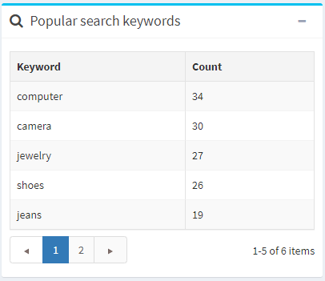
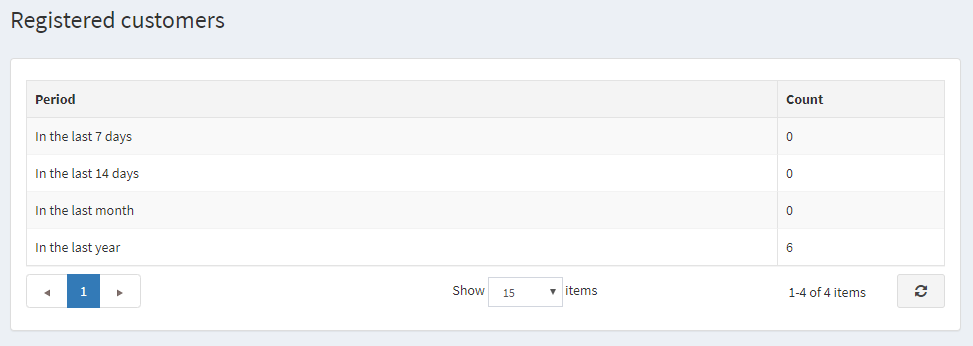
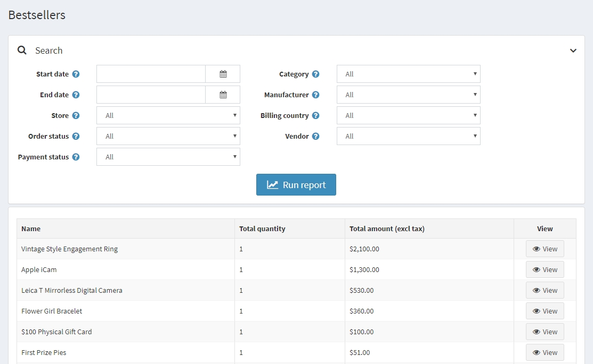

---
title: Reports
uid: en/running-your-store/reports
author: git.AndreiMaz
contributors: git.exileDev
---

# Reports

Reports are important for management, they allow to monitor store performance, track key metrics and support decision making. nopCommerce reports provide access to sales and customer information.

## Tutorials

* [Running reports in nopCommerce](https://www.youtube.com/watch?v=IbfoppTG9tM)

# Dashboard

The dashboard is the first page you see when accessing the admin area. It enables you to view your store statistics, including the total number of orders that were processed over the period of time you choose (year, month, week), registered customers, low stock products, the most popular products in your store, etc.

The dashboard consist of several blocks:

**nopCommerce news** Displays general nopCommerce news like new version releases.

**Common statistics.** Here you can find links to more detailed reports:

Sales → Orders

Sales → Returned requests

Customers → Registered customers

Catalog → Low stock report

**Order totals.** It enables you to know the number of orders that were processed in the last day, week, month, year and the order total.

**Incomplete orders.** It enables you to know the number of orders that are currently pending.

**Latest orders.**

**Popular search keywords.** This block displays most used keywords.

**Bestsellers.**

# Country report

Country report contains a list of orders that includes the number of orders and the total order sum in each country. This enables store owners to view the orders per country.

To view country reports, go to **Reports → Country Report**.

To search for the report, enter one or more of the following search criteria:

* **Start date** for the search
* **End date** for the search
* **Order status**, such as All, Pending, Processing, Complete, or Cancelled
* **Payment status**, such as All, Pending, Authorized, Paid, Refunded, Partially Refunded, or Voided

# Customer reports

Customer reports give a store owner general information about registered customers and their orders. To view the reports, go to **Reports → Customer reports**.

## Customers by order total

Enter one or several search criteria to compile a report:

* **Start date** for the search
* **End date** for the search
* **OrderStatus** as All, Pending, Processing, Complete, Cancelled
* **Payment Status** as All, Pending, Authorized, Paid, Refunded, Partially Refunded, Voided
* **Shipping Status** as All, Shipping not Required, Not Yet Shipped, Partially shipped, Shipped, Delivered

## Customers by number of orders

This report displays top 20 customers based on the total number of orders issued.

Enter one or several search criteria to compile a report:

* **Start date** for the search
* **End date** for the search
* **OrderStatus** as All, Pending, Processing, Complete, Cancelled
* **Payment Status** as All, Pending, Authorized, Paid, Refunded, Partially Refunded, Voided
* **Shipping Status** as All, Shipping not Required, Not Yet Shipped, Partially shipped, Shipped, Delivered

## Registered customers

This report displays the number of Registered customers for a certain period.

You can track the number of users registered within the last day, week, two weeks, month and year.

# Low Stock Reports

The low stock report contains a list of products that are currently under stock. In the example shown below, the min stock quantity was set to 20 and the stock quantity is 0, therefore a low stock report is generated for this product. You can set up low stock settings when adding the product.

**To view low stock reports:**

1. From the **Reports → Low Stock Report**. The **Product Low Stock** report window is displayed. 

    Low stock reports could be filtered by **Published** property,  which represents **Published** property of products

1. Click **Edit** to view the **Product info** tab, where these settings stock can settings can be changed.

# Bestsellers and products never purchased

Knowing the **bestselling** and **never purchased products** is very important for any shop owner. First of all, this can help in making *better purchasing decisions*: you can scale up on your popular items and exclude unpopular ones from your order list. When analyzing, consider, for example, whether certain colors sell faster, or whether your product sales depend on a season. Secondly, defining most and least selling goods can help you to *re-evaluate product design and marketing*. Maybe your best items go faster just because of their placement in your web store, or because of a better description. Come up with different options and test them. To do it more effectively, engage with your customers. *Conduct different surveys* to find out why the best selling items are preferred, what makes them special for your buyers. Use the insights to improve your marketing and increase sales.

## Bestsellers

**To view bestsellers** in nopCommerce, go to **Reports → Bestsellers**. Enter one or more of the following search criteria to run the report:

* **Start date** and/or **End date**
* **Store**, if you want to select one of your stores
* **Order status**, such as All, Pending, Processing, Complete, Cancelled
* **Payment status**, such as All, Pending, Authorized, Paid, Refunded, Partially Refunded, Voided
* **Category** list of Category
* **Manufacturer** list of Manufacturers
* **Billing Country** list of Countries
* **Vendor** list of Vendors

The report will break down your best-selling products based on both units sold and revenue.

## Products never purchased

To view products never purchased, go to **Reports → Products Never Purchased**. Enter Start date and/or End date for the report search.

